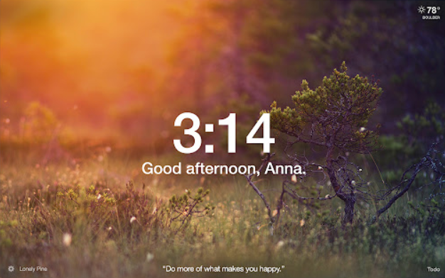

# nomadcoder chromeApp "Momentum" clone
  - 기능1 : greeting
  - 기능2 : 시계
  - 기능3 : 날씨
  - 기능4 : todoList
  



## 기초학습 
HTML이 파일내에 참조되어 있는 JS파일을 load하면 그때부터 Document객체 사용가능


## < Html의 요소들을 자바스크립트로 가져오는방법 >
1. 방법1.Accessing Elements by Unique Identifier (ID)   
리턴타입 : object
```js
const title = document.getElementById('title');
console.log(typeof title);
console.log(title);
title.innerHTML = "객체.메서드 사용가능"
```
2. 방법2.Accessing Elements by Class   
리턴타입 : object..정확히는 Array
```js
const person = document.getElementsByClassName('person');
console.log(typeof person);
console.log(person);
person.innerHTML ="(X) 객체.메서드 사용불가능..배열이니까"
person[1].innerHTML ="(O) 인덱스번호 명시하여 객체.메서드 사용가능"
```
3. 방법3.Accessing Elements by Tag   
리턴타입 : object...정확히는 Array
```js
const li = document.getElementsByTagName('li');
console.log(typeof li);
console.log(li);
li.innerHTML ="(X) 객체.메서드 사용불가능..배열이니까"
li[1].innerHTML ="(O) 인덱스번호 명시하여 객체.메서드 사용가능"
```
4. 방법4.Accessing Elements by CSS Selector
```js
//리턴타입: object
const title = document.querySelector('#title');
console.log(typeof title);
console.log(title);
title.innerHTML = "객체.메서드 사용가능"

//리턴타입 : object...정확히는 Array
const hello = document.querySelectorAll('.hello h1:first-child');
console.log(typeof hello);
console.log(hello)
hello.innerHTML ="(X) 객체.메서드 사용불가능..배열이니까"
hello[1].innerHTML ="(O) 인덱스번호 명시하여 객체.메서드 사용가능"
```

## < 가져온 HTMl 요소들을 자바스크립트로 변경하는 방법>
1. 방법1_html element.addEventListener(”event”,func)
가져온 Html 요소들에 event Listener 추가하기   
해당 html요소들에서 발생하는 event(클릭,키보드 등의 사용자 행동)를 감지하여   
event에 호출할 함수를 명시해두고, 클릭했을때 특정 동작이 이루어지도록 설정할 수 있다.

2. 방법2_window.addEventListener(”event”,func)

## <가져온 HTML 요소들을 CSS로 변경하는 방법>
가져온 html요소들의 style을 자바스크립트로 변경가능하지만   
스타일관련 사항은 css파일에서 통합관리하는 것이 효율적이다.   
  - classList 
  - classList.toggle


## window 객체


## 브라우저의 기본동작 제어 
addEventLinstener에 감지할동작과 함수를 명시해놓으면 자바스크립트가 특정 동작이 감지됬을때,
명시된 함수를 자동으로 실행시켜 준다. 이때 내가 명시한 함수기능 외에 브라우저의 기본동작이 함께 실행된다.
브라우저의 기본동작이란 브라우저가 특정function에 대해 기본적으로 수행하는 동작을 의미한다.
이 기본동작을 막기위해 개발자가 별도로 제어하는 작업이 필요한 경우가 있다.   
preventDefault()

  - Form의 기본동작 : submit + 새로고침
    브라우저는 Form이 submit되면 화면을 자동으로 새로고침한다.   
    사용자가 입력한 내용이 화면에 남아있도록 새로고침 되지 않도록 제어.
  
  - Link의 기본동작 : 연결된 사이트로 이동


## LocalStorage 사용하기 


